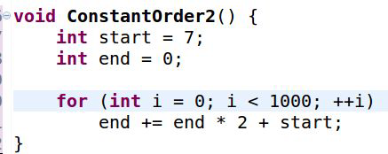
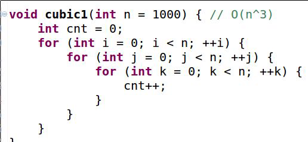
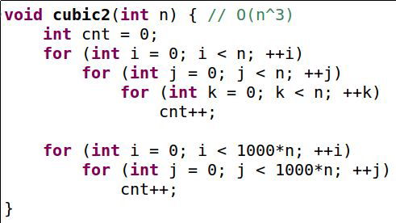
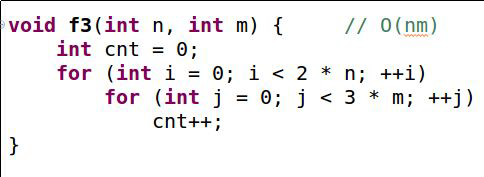

# 📈 Time Complexity

## Asymptotic Complexity – Three Types

- 💡 **Best Case**: Omega Notation `Ω`
- 💡 **Average Case**: Theta Notation `Θ`
- 💡 **Worst Case**: Big O Notation `O`

---

## 🧠 خطوات حساب Time Complexity:

1. احسب عدد الخطوات لتكوين معادلة رياضية.
2. احذف جميع الثوابت والأرقام الصغيرة.
3. خذ أكبر أس (power) للمتغير `n` في حالة وجود متغير واحد.
4. إذا وُجد أكثر من متغير، نأخذ كل المتغيرات المؤثرة.

---

## 🏁 ترتيب تعقيد الوقت من الأفضل للأسوأ:

| التعقيد       | التقييم       | الوصف                                                |
|---------------|----------------|-------------------------------------------------------|
| `O(1)`        | ✅ ممتاز       | وقت ثابت، لا يتأثر بحجم البيانات.                     |
| `O(log n)`    | 👍 جيد جدًا    | نمو لوغاريتمي، فعال جدًا للبيانات الكبيرة.            |
| `O(n)`        | 🙂 متوسط       | نمو خطي، جيد للحجم المتوسط.                          |
| `O(n log n)`  | 😐 مقبول       | شائع في الخوارزميات الفعالة مثل Merge Sort.         |
| `O(n²)`       | ❌ ضعيف        | نمو تربيعي، بطيء جدًا مع البيانات الكبيرة.           |
| `O(2ⁿ)`       | 🚫 سيء جدًا     | نمو أُسي، غير عملي مع الحجم الكبير.                  |
| `O(n!)`       | 💀 كارثي        | نمو مضاعف، لا يُستخدم مع بيانات كبيرة إطلاقًا.       |

